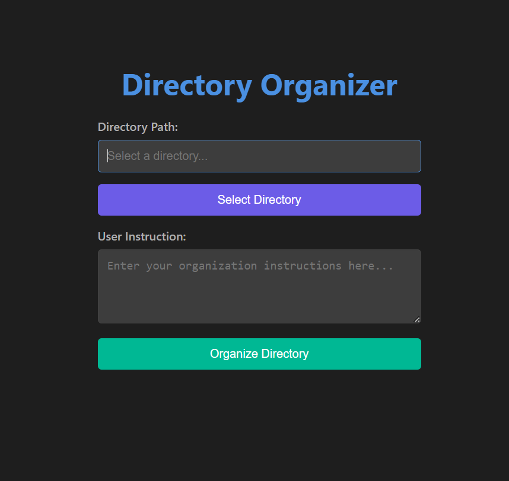

# Directory Organizer

**Directory Organizer** is an Electron-based desktop application that helps you organize files in a directory based on user-defined instructions. It provides a simple and intuitive interface to select a directory, specify organization rules, and execute the organization process.

---

## Features

- **Select Directory**: Choose a directory to organize.
- **Custom Instructions**: Provide instructions on how to organize the files.
- **Dark Theme**: Sleek and modern dark-themed UI.
- **Real-time Feedback**: Alerts for success or error messages.
- **Loader**: Spinner to indicate processing during organization.

---

## Screenshots

  
_Example: Screenshot of the app._

---

## Prerequisites

Before running the app, ensure you have the following installed:

- [Node.js](https://nodejs.org/) (v16 or higher)
- [npm](https://www.npmjs.com/) (usually comes with Node.js)
- [Electron](https://www.electronjs.org/) (will be installed as a dependency)

---

## Installation

1. **Clone the repository**:
   ```bash
   git clone https://github.com/choxxin/Ai_Dir_org
   cd directory-organizer
   ```
